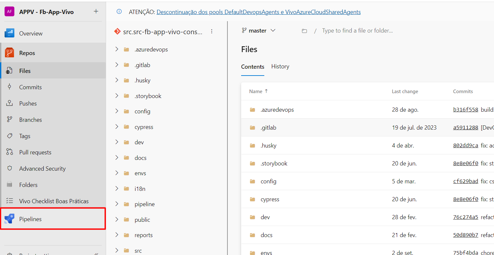
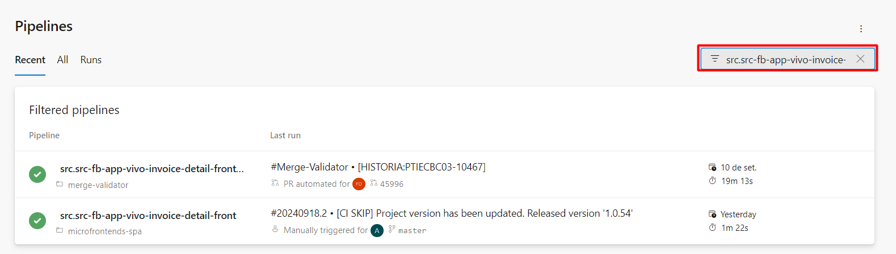
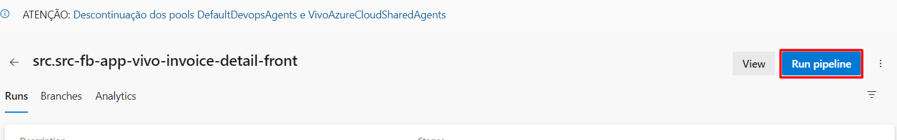
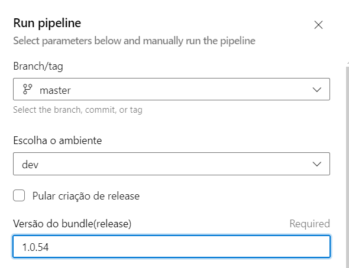

# 🍉 Manual do deploy

> **Nota**
>
> Este guia descreve o processo para realizar o deploy de uma aplicação de forma segura e eficiente. Ele abrange desde a
preparação do ambiente até a finalização do deploy em produção, incluindo boas práticas e ferramentas recomendadas.
>O deploy pode ser realizado apenas após a Branch com as alterações ser mergeada na Master
> {style="note"}

• Passo 1: Clique em Pipelines

• Passo 2: Busque pelo Repositório que será feito o deploy

• Passo 3: Clique no Repositório referente ao micro-frontend

• Passo 4: Clique em Run Pipeline

• Passo 5: Preencha conforme o ambiente em que será feito o Deploy

*Obs: as opções a baixo podem ser deixadas no padrão*

## Como obter o numero da versão ?

O numero da versão anterior pode ser encontrado na no arquivo "Package.json" na master:

Ou observando o numero da ultima versão que foi feito o Deploy.

Então basta contar as ultimas alterações a partir do ultimo deploy, e definir a próxima:

Para subir pra ambiente como pre-prod ou darklauncher precisa marcar para pula criação somente

